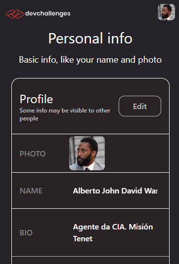
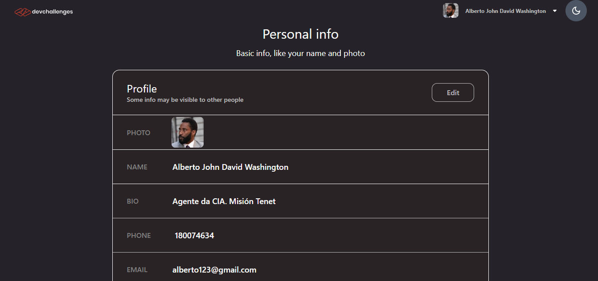

# Back-end Authentication System



Este repositorio contiene el backend para un sistema de autenticación. La API ofrece endpoints para el registro de usuarios, inicio de sesión, verificación de correo electrónico, actualización de perfil de usuario y manejo de imágenes de perfil. Está construido con Node.js, Express y utiliza JWT para la autenticación.

## Tabla de Contenidos

- [Instalación](#instalación)
- [Uso](#uso)
- [Endpoints](#endpoints)
- [Swagger API Documentation](#swagger-api-documentation)
- [Estructura del Proyecto](#estructura-del-proyecto)
- [Contribuciones](#contribuciones)
- [Licencia](#licencia)

## Instalación

1. Clona el repositorio:

```bash
git clone https://github.com/devHyrum/Back-end-Authentication-System.git
```
2. Navega al directorio del proyecto:
```bash
cd Back-end-Authentication-System
```
3. Instala las dependencias:
```bash
npm install
```
4. Crea un archivo .env en la raíz del proyecto y define las siguientes variables de entorno:
```bash
PORT=3000
DB_SECRET_KEY=your_secret_key
```

## Uso
Para iniciar el servidor de desarrollo, ejecuta:
```bash
npm start
```
El servidor se ejecutará en http://localhost:3000.

## Endpoints
### Autenticación
- **POST /api/auth/register**
    - **Registra un nuevo usuario.**
    - **Cuerpo de la solicitud**: { "username": "user", "password": "pass", "email": "email" }
    - **Respuesta**: { "message": "Usuario registrado exitosamente" }
- **POST /api/auth/login**
    - **Inicia sesión un usuario.**
    - **Cuerpo de la solicitud**: { "username": "user", "password": "pass" }
    - **Respuesta**: { "token": "jwt_token" }
- **POST /api/auth/check-email**
    - Verifica si un correo electrónico ya está registrado.
    - **Cuerpo de la solicitud**: { "email": "email" }
    - **Respuesta**: { "exists": true/false }
### Usuarios
- **GET /api/auth/me**
    - Obtiene información del usuario autenticado.
    - Requiere token JWT en los encabezados.
- **PUT /api/auth/update**
    - Actualiza la información del usuario.
    - Requiere token JWT en los encabezados y puede incluir una imagen de perfil.
- **GET /api/auth/image/**
    - Obtiene la imagen de perfil del usuario autenticado.
    - Requiere token JWT en los encabezados.

## Swagger API Documentation
La documentación de la API está disponible en /api-docs. Para generar la documentación con Swagger, sigue estos pasos:

1. Instala las dependencias necesarias:
```bash
npm install swagger-ui-express swagger-autogen
```
2. Genera la documentación:
```bash
npm run swagger-autogen
```
3. Inicia el servidor y navega a http://localhost:3000/api-docs para ver la documentación interactiva.

## Estructura del Proyecto
```plaintext
.
├── config
│   ├── config.js
│   ├── multer.js
│   └── db.js
├── controllers
│   └── usuarios.controller.js
├── helpers
│   └── errorHandler.js
├── middleware
│   └── auth.js
├── models
│   └── Usuario.js
├── routes
│   ├── auth.routes.js
│   └── index.routes.js
├── index.js
├── swagger.js
├── package.json
└── README.md
```
## Contribuciones
Las contribuciones son bienvenidas. Para contribuir, por favor sigue estos pasos:

1. Haz un fork del repositorio.
2. Crea una nueva rama (git checkout -b feature-nueva-funcionalidad).
3. Realiza tus cambios.
4. Haz un commit de tus cambios (git commit -am 'Añadir nueva 1. funcionalidad').
5. Sube tus cambios (git push origin feature-nueva-funcionalidad).
6. Abre un Pull Request.